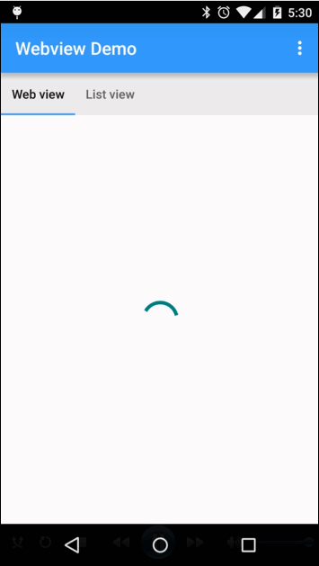

Android WebView and Javascript injection
=======================

Use cases supported
- Load the remote web form via WebView
- Allow the user to fill the form and submit
- Capture the input data and persist them in SQLite db
- ListView to see all the previous entries

